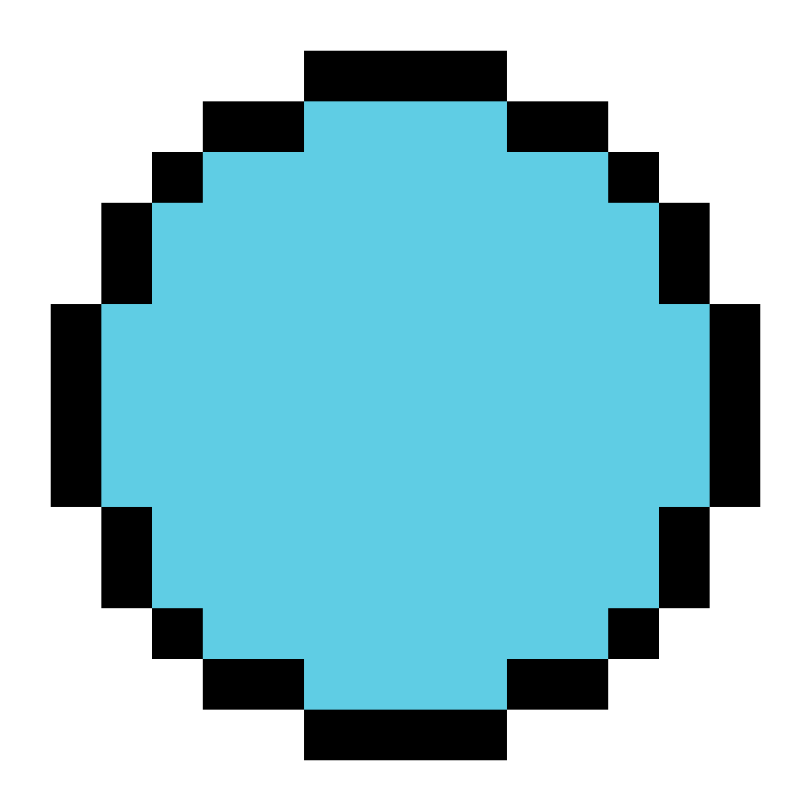
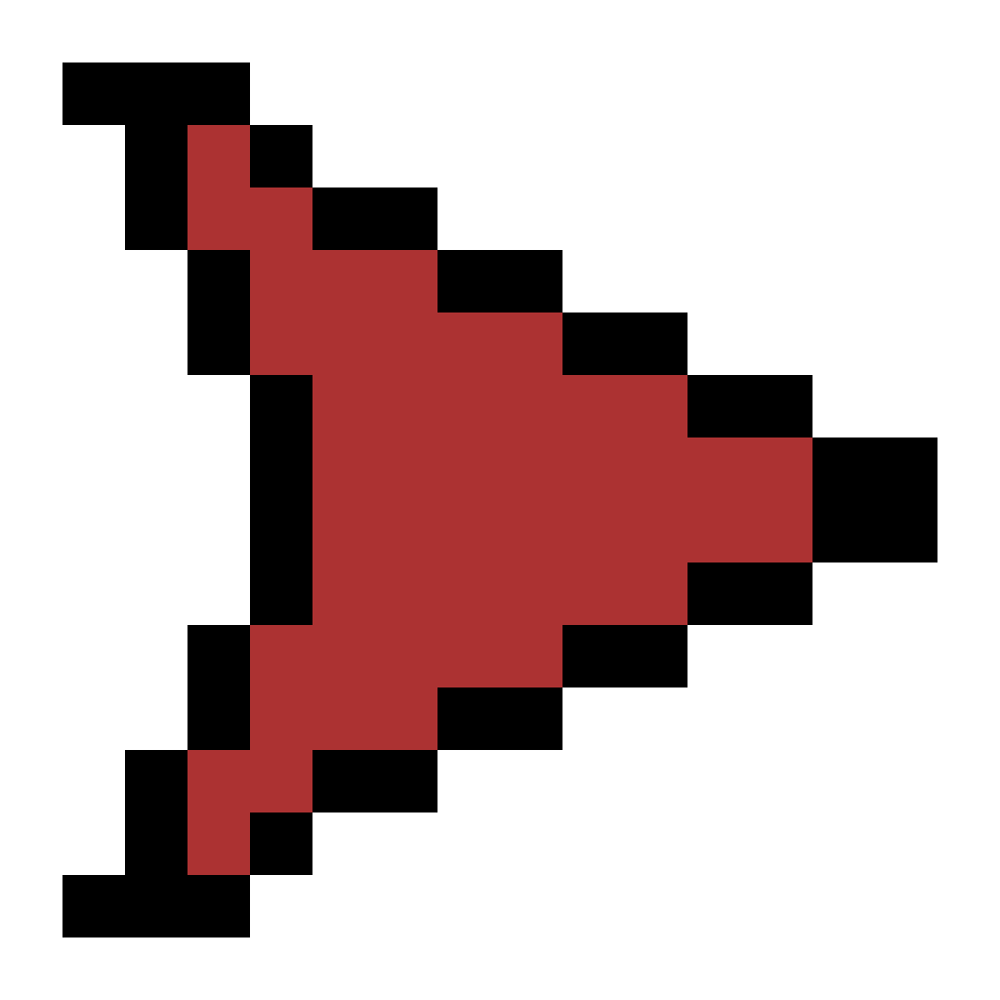
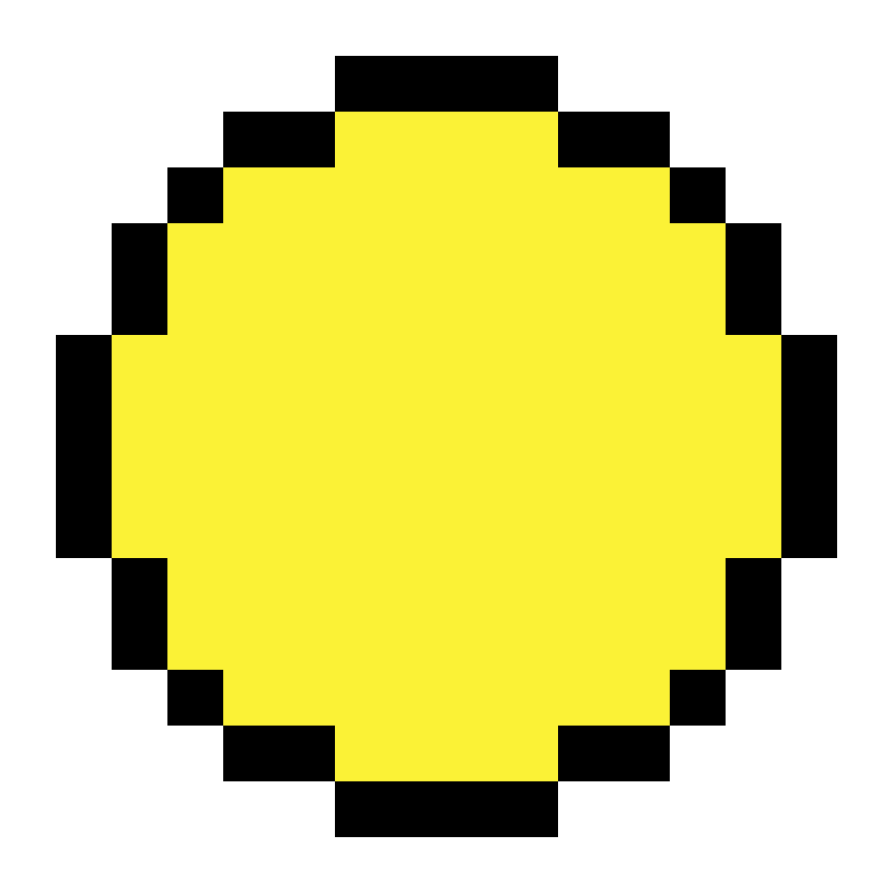
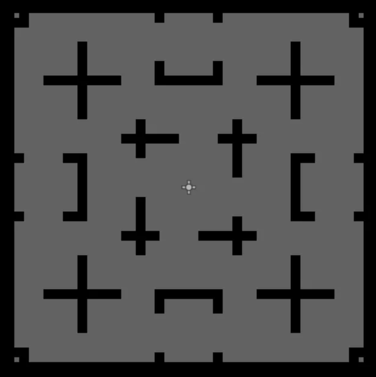

# Don’t Stop

***Don’t Stop*** is a 2D arcade game made by Ian Roller using the Godot game engine.

## Table of Contents
1. [Controls](#controls)
2. [Story](#story)
3. [Objective](#objective)
4. [Scoring](#scoring)
5. [Risk and Reward](#risk-and-reward)
6. [You, the Player](#you-the-player)
7. [Meet the Enemies](#meet-the-enemies)
    - [The Tracker](#the-tracker)
    - [The Slider](#the-slider)
    - [The Blocker](#the-blocker)
8. [The Arena](#the-arena)
9. [Quick Tips](#quick-tips)

## Controls

- **WASD / Arrow Keys**: Move
- **Space**: Dash
- **Q**: Add enemy
- **E**: Pause

## Story

WELCOME PLAYER, TO THE ARENA! 

I am the Game Master. Here's what you need to know.

There is no hiding. There is no killing. There is no escape. Your only option left? Run.

Run from the monsters for as long as you can to achieve a high score. 

Want to boost your score faster? Of course you do! Simply let me know and I will make that number get bigger faster.......... and maybe let some more monsters into the arena at the same time. So I get it. You may be saying "I just want to see my score get bigger faster, why more monsters?" I get it, I truly do. But I've got to keep it interesting for all of my adoring fans. So more monsters means more risk and more risk means more points. Good? Good! Glad we are on the same page.

Don't worry too much though, I have decided to be generous today and give you the ability to *dash*. Find yourself surrounded by monsters with no way out? Simply dash through them like they aren't even there! But just be careful you may or not be able to use it again for a while. Just warning you. I can't make it too easy for you. I did mention my adoring fans right, got to keep it interesting for them.

Oh, and by the way the game ends when you're dead, no biggie right, you signed the papers right? Good!

LET THE GAME BEGIN!

## Objective

Your objective is very simple. Survive for as long as possible to earn a high score by avoiding an ever-growing, never-shrinking horde of enemies.

## Scoring

Your score increases by the amount of enemies currently in the arena. More enemies means more points.

## Risk and Reward

While new enemies will be added every five seconds, you have the option to add enemies whenever you wish. This, of course, will increase the amount your score increases by, however, you will also be raising the difficulty at a faster rate than would naturally happen.

So, what do you want to do? More points but a harder time or a smoother more natural experience.

## You, the Player

This is you.

Now I know you may not look like much but trust me you got a couple tricks up your sleeve.

For starters you are pretty tough being able to take three hits from some pretty strong enemies.

Secondly, after you are hit you become invincible for a time.

Finally, you have your special move, the *dash*. The dash allows you to move faster, become invincible and pass right through enemies.

 
 
 

## Meet the Enemies

During your time in the arena you, the player, will encounter three different types of enemies. The Tracker, the Slider, and the Blocker. Let's get to know them a bit more so you can survive your encounters in the arena.

### The Tracker

The Tracker is the first enemy you can expect to encounter in the arena.

The Tracker is a being of focus, commitment, and sheer will. A Tracker will chase the player no matter where they try to run to. You cannot stop for a moment, for a tracker will find you eventually.

 
 
 
 

### The Slider

The Slider is a more chaotic type of enemy you can expect to find in the arena.

Whereas the Tracker will never stop following you, the Slider is a bit more in its own world. The Slider slides through the arena and bounces off the exterior walls letting physics take it where it wants. 

However, don’t forget that the Slider will hurt you just as much as the Tracker. Even if it does not seem to care about you.

 
 
 
 
 

### The Blocker

The Blocker is a passive, but strategically dangerous enemy you can expect to encounter in the arena.

While Blockers will hurt you, they do not actively seek you out. Instead a Blocker will seek out its favorite spot in the arena and stay there. Thus shrinking the arena by removing paths and forcing you to use your dash ability.

Unlike its fellow enemies, a max of 12 Blockers can exist at a time, thus making them the rarest of the three.

 
 
 
 

## The Arena

This is the arena where you will run to survive as long as possible.

Here are a few tips for your survival:

1. Enemies will spawn in each of the four corners, so avoid those areas as much as possible.
2. Be careful once Blockers start to appear as the only way to get past them is to use your dash and Blockers have a nasty habit of blocking the only ways in or out of an area.
3. NEVER STOP MOVING!

## Quick Tips
- Use your dash to escape a dangerous situation
- Avoid arena corners when possible as that is where enemies spawn
- More enemies mean more points so add enemies when you think you can handle them