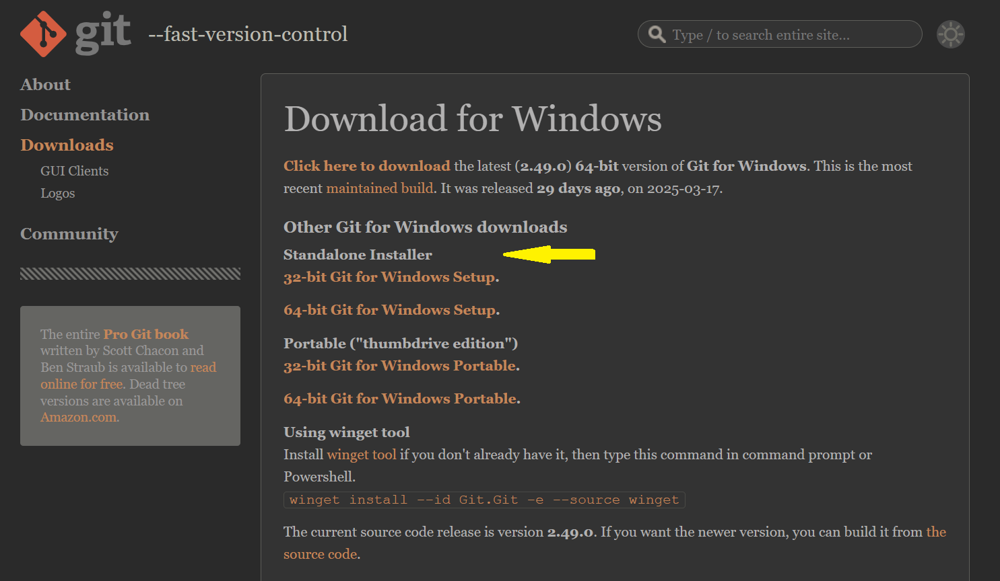

# How to Install Git for Windows 11
> A quick step-by-step guide for beginners

## Steps
1. Go to [https://git-scm.com/](https://git-scm.com/)

2. Click on **Downloads**

3. Select **Windows** to go to the download for windows page

4. Under **Standalone Installer** choose the correct version for your system
    - **32-bit Git for Windows Setup** or **64-bit Git for Windows Setup** 
    
    - *Not sure which to choose?*
      - Go to **Settings > System > About**
      - Look under **Device Specifications** for **System type** 

5. Once download is complete, open the file and follow the on-screen instructions
6. To confirm the installation:
    - Open the **Command Prompt**
      - *Not sure how?*
        - Press the **Windows** key and search *command prompt*
        - Click **Command Prompt** from the search results
    - In the **Command Prompt** window, type the following and press **Enter**:
    ```
    git --version
    ```
    - If installed correctly, you will see something like this:
    ```
    git version 2.49.0.windows.1
    ```